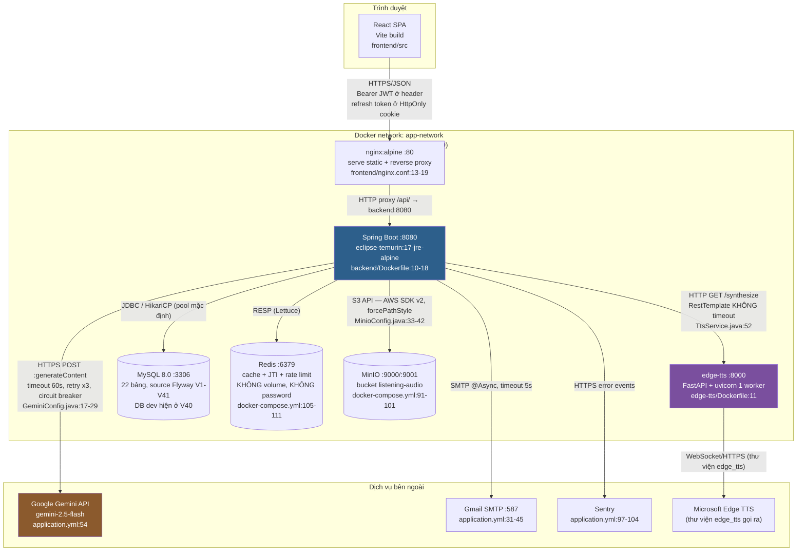
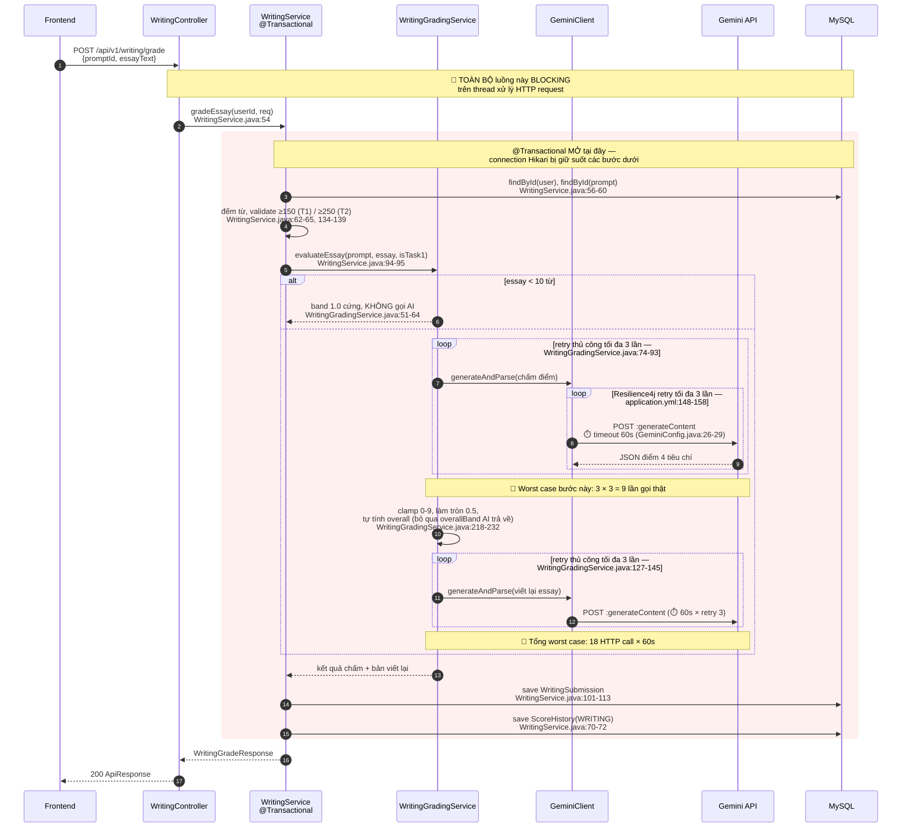
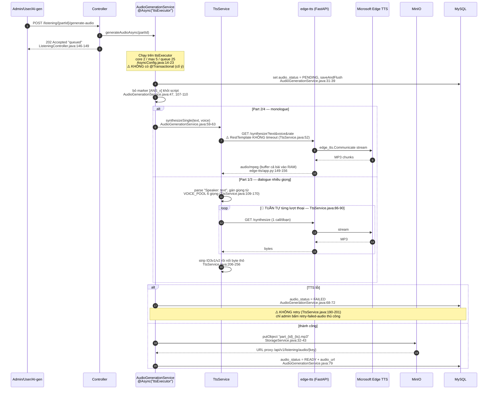
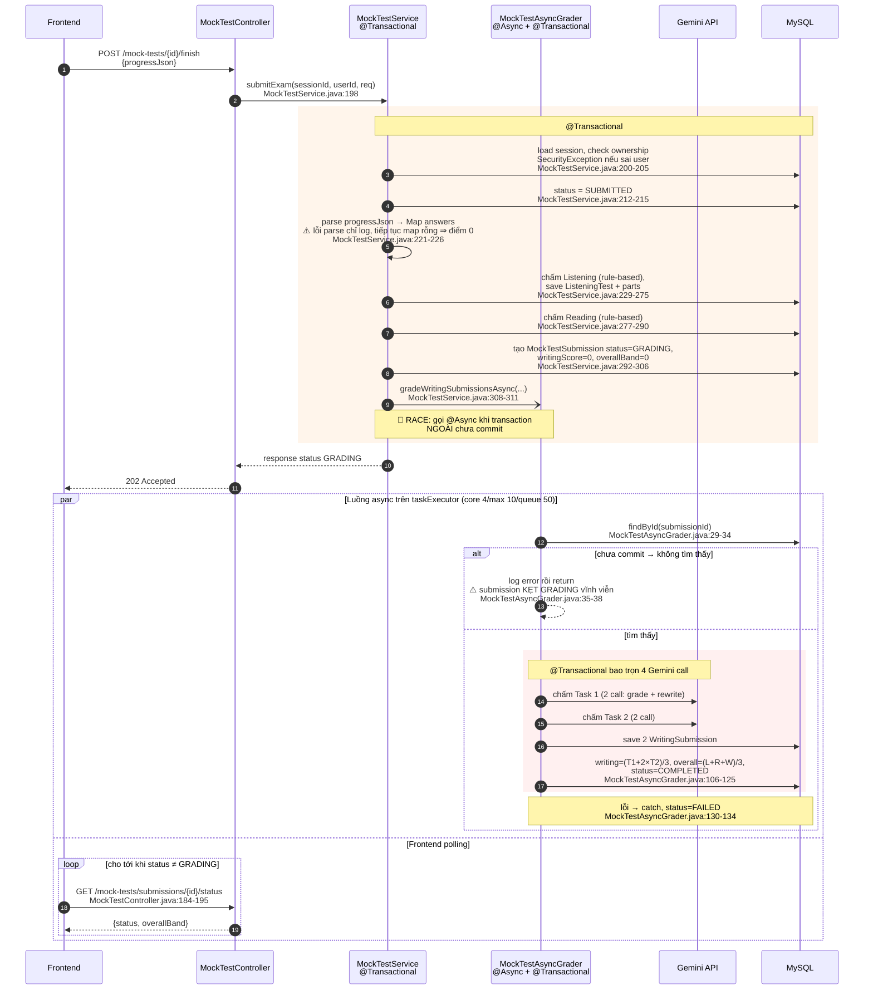
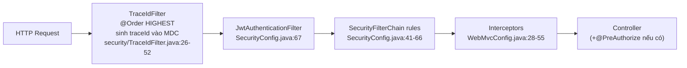

# ARCHITECTURE — IELTS SmartPrep

> Tài liệu này được viết bằng cách **đọc code**, không suy đoán. Mọi khẳng định đều kèm `đường/dẫn/file.ext:dòng`.
> Đường dẫn tính từ thư mục `ielts-smartprep/`. Chỗ nào không xác minh được từ code sẽ ghi rõ **CHƯA RÕ**.
>
> Ngày dựng tài liệu: 2026-07-26. Commit gần nhất khi đọc: `cb7ec0b fix(security): harden sensitive data handling`.

---

## A. Tech stack thật sự

### A.1. Backend — Java / Spring Boot

Trích từ `backend/pom.xml`:

| Thành phần | Phiên bản | Vị trí |
|---|---|---|
| Spring Boot (parent) | **3.2.5** | `backend/pom.xml:7-12` |
| Java | **17** | `backend/pom.xml:21` |
| Artifact | `com.smartprep:ielts-smartprep:1.0.0` | `backend/pom.xml:14-16` |
| spring-boot-starter-web | theo parent | `backend/pom.xml:30-33` |
| spring-boot-starter-security | theo parent | `backend/pom.xml:36-39` |
| spring-boot-starter-data-jpa + mysql-connector-j | theo parent | `backend/pom.xml:42-50` |
| Flyway (core + mysql) | theo parent | `backend/pom.xml:53-60` |
| spring-boot-starter-validation | theo parent | `backend/pom.xml:63-66` |
| spring-boot-starter-actuator | theo parent | `backend/pom.xml:69-72` |
| **jjwt** (api/impl/jackson) | **0.12.5** | `backend/pom.xml:22, 75-91` |
| Lombok | theo parent (optional) | `backend/pom.xml:94-98` |
| springdoc-openapi (Swagger UI) | **2.3.0** | `backend/pom.xml:101-105` |
| **Resilience4j** (spring-boot3) | **2.2.0** | `backend/pom.xml:108-112` |
| **Bucket4j** (core + redis) | **8.10.1** | `backend/pom.xml:115-124` |
| spring-boot-starter-aop | theo parent | `backend/pom.xml:127-130` |
| spring-boot-starter-data-redis | theo parent | `backend/pom.xml:133-136` |
| spring-boot-starter-mail | theo parent | `backend/pom.xml:139-142` |
| **Sentry** (spring-boot-starter-jakarta + logback) | **7.22.0** | `backend/pom.xml:23, 145-154` |
| logstash-logback-encoder (log JSON) | **8.0** | `backend/pom.xml:157-161` |
| **AWS SDK v2 S3** (dùng cho MinIO) | **2.25.60** | `backend/pom.xml:164-168` |
| Apache HttpClient 5 | theo BOM parent | `backend/pom.xml:171-174` |
| Test: spring-boot-starter-test, **Testcontainers 1.21.4**, spring-security-test | | `backend/pom.xml:24, 176-204` |
| JaCoCo | **0.8.12** | `backend/pom.xml:231-285` |

Class main: `com.smartprep.SmartPrepApplication` (`backend/src/main/java/com/smartprep/SmartPrepApplication.java:6-10`) — chỉ có `@SpringBootApplication`, không annotation nào khác.

### A.2. Frontend — React / Vite

Trích từ `frontend/package.json`:

| Thành phần | Phiên bản | Vị trí |
|---|---|---|
| axios | ^1.16.1 | `frontend/package.json:34-40` |
| react-router-dom | ^7.15.1 | `frontend/package.json:34-40` |
| @tanstack/react-query | ^5.101.0 | `frontend/package.json:34-40` |
| recharts | ^3.8.1 | `frontend/package.json:34-40` |
| @sentry/react | ^10.56.0 | `frontend/package.json:34-40` |
| Vite | ^8.0.12 (dev) | `frontend/package.json:15-33` |
| TypeScript | ~6.0.2 (dev) | `frontend/package.json:15-33` |
| Vitest + @testing-library/react + jsdom | ^4.1.8 / ^16.3.2 / ^29.1.1 | `frontend/package.json:15-33` |
| Tailwind CSS | ^3.4.19 | `frontend/package.json:15-33` |

⚠️ **Bất thường:** `react` và `react-dom` **không xuất hiện** trong cả `dependencies` lẫn `devDependencies` (`frontend/package.json:15-40`) trong khi code dùng JSX (`frontend/src/context/AuthContext.jsx:1`). Build hiện chạy được nhờ lockfile, nhưng `npm install` sạch trên máy khác có thể gãy. **CHƯA RÕ** react được resolve từ đâu — cần kiểm tra `frontend/package-lock.json`.

Codebase là **hỗn hợp .ts và .jsx**: `frontend/src/api/` có cả TypeScript (`axiosClient.ts`, `authService.ts`, `readingApi.ts`, `writingApi.ts`, `attemptApi.ts`, `analyticsApi.ts`, `statsApi.ts`, `types.ts`) lẫn JavaScript (`adminApi.js`, `listeningApi.js`, `mockTestApi.js`, `vocabApi.js`).

### A.3. Microservice TTS — Python

- FastAPI (`edge-tts/app.py:9, 50`), thư viện `edge_tts` (`edge-tts/app.py:8`).
- Base image `python:3.10-slim` (`edge-tts/Dockerfile:1`).
- ⚠️ **Không pin version dependency nào**: `pip install --no-cache-dir fastapi uvicorn edge-tts` (`edge-tts/Dockerfile:5`), không có `requirements.txt`.
- Chạy bằng **uvicorn 1 worker** (không có `--workers`): `edge-tts/Dockerfile:11`.

### A.4. Hạ tầng

| Hạ tầng | Image / phiên bản | Vị trí |
|---|---|---|
| MySQL | `mysql:8.0` | `docker-compose.yml:73` |
| Redis | `redis:alpine` (không pin) | `docker-compose.yml:106` |
| MinIO (S3-compatible) | `minio/minio:latest` (không pin) | `docker-compose.yml:91` |
| Nginx (serve frontend + reverse proxy) | `nginx:alpine` | `frontend/Dockerfile:10` |

**Redis được dùng cho 4 việc khác nhau** (điểm dễ bị hỏi khi phỏng vấn):
1. Cache Spring (`spring.cache.type: redis`, TTL mặc định 24h) — `backend/src/main/resources/application.yml:29-30`, `backend/src/main/java/com/smartprep/config/CacheConfig.java:16-30`.
2. Lưu JTI của refresh token + blacklist token — `backend/src/main/java/com/smartprep/service/TokenService.java:29, 35-40, 55-66`.
3. Rate limit bucket (Bucket4j qua Lettuce) — `backend/src/main/java/com/smartprep/config/RateLimitConfig.java:26-43`.
4. Counter dùng token Gemini + đếm quota AI theo ngày — `backend/src/main/java/com/smartprep/service/ai/GeminiClient.java:116-147`, `backend/src/main/java/com/smartprep/security/RateLimitInterceptor.java:52-59`.

⚠️ Redis **không có volume** trong compose (`docker-compose.yml:105-111`) → restart Redis là mất toàn bộ refresh token, blacklist và quota AI trong ngày.

**Không có message queue thật** (không có Kafka/RabbitMQ/SQS trong `backend/pom.xml` và `docker-compose.yml`). Cái gọi là "queue" trong code là `ThreadPoolTaskExecutor` in-memory (`backend/src/main/java/com/smartprep/config/AsyncConfig.java:14-34`).

---

## B. Sơ đồ kiến trúc

**Những điểm cần nhớ về topology:**

- Chỉ có **1 tiến trình backend**, không có worker riêng. Mọi việc nặng (chấm AI, sinh audio) chạy trên thread pool trong cùng JVM đó — `backend/src/main/java/com/smartprep/config/AsyncConfig.java:14-34`.
- `edge-tts` **không có healthcheck, không có depends_on** (`docker-compose.yml:56-70`).
- MySQL (3306), Redis (6379), MinIO (9000/9001), edge-tts (8000) đều **publish port ra host** thay vì chỉ expose nội bộ (`docker-compose.yml:75-76, 94-96, 108-109, 59-60`).
- CI chỉ có test/lint, **không có bước build image hay deploy** dù file tên `ci-cd.yml` (`.github/workflows/ci-cd.yml:1-63`).

---

## C. Bảng toàn bộ API endpoint

Quy ước cột **Auth**:
- `permitAll` = khai báo tường minh trong `backend/src/main/java/com/smartprep/config/SecurityConfig.java:43-61`.
- `JWT` = không có annotation ở controller, được bảo vệ bởi `anyRequest().authenticated()` (`SecurityConfig.java:65`).
- `ADMIN` = `hasRole("ADMIN")` qua URL matcher `/api/v1/admin/**` (`SecurityConfig.java:64`), một số controller có thêm `@PreAuthorize` class-level.

### C.1. AuthController — `/api/v1/auth` (`backend/src/main/java/com/smartprep/controller/AuthController.java:30`)

| Method | Path | Auth | Input | Output | file:line |
|---|---|---|---|---|---|
| POST | `/api/v1/auth/register` | permitAll (`SecurityConfig.java:44`) | `@Valid RegisterRequest`: `@NotBlank @Email email`, `@Size(3-50) username`, `@Size(6-100) password` (`dto/request/RegisterRequest.java:12-22`) | 201 `ApiResponse<AuthResponse>` + Set-Cookie refreshToken | `controller/AuthController.java:49-51` |
| POST | `/api/v1/auth/login` | permitAll (`SecurityConfig.java:45`) | `@Valid LoginRequest`: `@NotBlank username/password` (`dto/request/LoginRequest.java:10-16`) | `ApiResponse<AuthResponse>` + cookie | `controller/AuthController.java:58-60` |
| POST | `/api/v1/auth/refresh` | permitAll (`SecurityConfig.java:46`) | `@CookieValue refreshToken` hoặc body `RefreshTokenRequest` (**không `@Valid`**) | `ApiResponse<AuthResponse>` + cookie mới (rotation) | `controller/AuthController.java:67-71` |
| POST | `/api/v1/auth/logout` | JWT | cookie/body refresh token + header Authorization (đều optional) | `ApiResponse<Void>` + xoá cookie | `controller/AuthController.java:77-82` |
| POST | `/api/v1/auth/forgot-password` | permitAll (`SecurityConfig.java:47`) | `@Valid ForgotPasswordRequest`: `@NotBlank @Email` (`dto/request/ForgotPasswordRequest.java:11`) | `ApiResponse<Void>` — **luôn 200** chống user enumeration | `controller/AuthController.java:92-94` |
| POST | `/api/v1/auth/reset-password` | permitAll (`SecurityConfig.java:48`) | `@Valid ResetPasswordRequest`: `@NotBlank token`, `@Size(6-100) newPassword` (`dto/request/ResetPasswordRequest.java:11-17`) | `ApiResponse<Void>` | `controller/AuthController.java:100-102` |
| GET | `/api/v1/auth/verify-email` | permitAll (`SecurityConfig.java:49`) | `@RequestParam String token` (không validation) | `ApiResponse<Void>` | `controller/AuthController.java:109-111` |
| POST | `/api/v1/auth/resend-verification` | JWT | — (principal) | `ApiResponse<Void>` | `controller/AuthController.java:116-118` |
| GET | `/api/v1/auth/me` | JWT | — | `ApiResponse<AuthResponse>` | `controller/AuthController.java:125-127` |
| PUT | `/api/v1/auth/profile` | JWT | `@Valid UpdateProfileRequest`: `@NotBlank displayName`, 3 target score `@NotNull`, `avatarUrl` không validation (`dto/request/UpdateProfileRequest.java:10-22`) | `ApiResponse<AuthResponse>` | `controller/AuthController.java:132-136` |
| PUT | `/api/v1/auth/password` | JWT | `@Valid ChangePasswordRequest` (`dto/request/ChangePasswordRequest.java:9-14`) | `ApiResponse<Void>` | `controller/AuthController.java:141-146` |
| POST | `/api/v1/auth/avatar` | JWT | `MultipartFile` — validate thủ công: không rỗng, content-type PNG/JPEG, ≤5MB (`controller/AuthController.java:160-169`) | `ApiResponse<Map>` (avatarUrl) | `controller/AuthController.java:155-159` |
| GET | `/api/v1/auth/avatar/{fileName}` | **permitAll** (`SecurityConfig.java:52`) | `@PathVariable String fileName` → thẳng vào `storageService.downloadAudio` (`controller/AuthController.java:182`) | `Resource` ảnh, fallback ảnh mặc định | `controller/AuthController.java:178-180` |

### C.2. WritingController — `/api/v1/writing` (`backend/src/main/java/com/smartprep/controller/WritingController.java:22`)

| Method | Path | Auth | Input | Output | file:line |
|---|---|---|---|---|---|
| GET | `/api/v1/writing/prompts` | JWT | `essayType` (String tự do) | `ApiResponse<List<WritingPromptResponse>>` | `controller/WritingController.java:36-42` |
| GET | `/api/v1/writing/prompts/{promptId}` | JWT | `@PathVariable` | `ApiResponse<WritingPromptResponse>` | `controller/WritingController.java:48-54` |
| POST | `/api/v1/writing/grade` | JWT | `@Valid WritingGradeRequest`: `@NotNull promptId`, `@NotBlank @Size(max=10000) essayText` (`dto/request/WritingGradeRequest.java:15-20`) | `ApiResponse<WritingGradeResponse>` — **AI đồng bộ 💰** | `controller/WritingController.java:60-67` |
| GET | `/api/v1/writing/history` | JWT | — | `List<WritingHistoryResponse>` (không phân trang) | `controller/WritingController.java:73-79` |
| GET | `/api/v1/writing/submissions/{submissionId}` | JWT | `@PathVariable` | `ApiResponse<WritingGradeResponse>` | `controller/WritingController.java:85-92` |
| GET | `/api/v1/writing/assemble` | JWT | — (**không lấy user**, `controller/WritingController.java:100`) | `List<WritingPromptResponse>` | `controller/WritingController.java:98-103` |
| POST | `/api/v1/writing/submit-full` | JWT | `@Valid WritingSubmitFullRequest` — ⚠️ `task1EssayText`/`task2EssayText` **không có `@Size`** (`dto/request/WritingSubmitFullRequest.java:13-23`) | `ApiResponse<WritingFullResultResponse>` — **AI đồng bộ 2 bài 💰💰** | `controller/WritingController.java:109-116` |
| POST | `/api/v1/writing/generate-mock` | JWT | `@Valid WritingGenerateRequest` (`dto/request/WritingGenerateRequest.java:13-18`) | `List<WritingPromptResponse>` — **AI 💰** | `controller/WritingController.java:124-131` |
| GET | `/api/v1/writing/full-history` | JWT | — | `List<WritingFullResultResponse>` (không phân trang) | `controller/WritingController.java:137-143` |
| GET | `/api/v1/writing/full-submissions/{id}` | JWT | `@PathVariable` | `ApiResponse<WritingFullResultResponse>` | `controller/WritingController.java:149-156` |

### C.3. ReadingController — `/api/v1/reading` (`backend/src/main/java/com/smartprep/controller/ReadingController.java:23`)

| Method | Path | Auth | Input | Output | file:line |
|---|---|---|---|---|---|
| POST | `/api/v1/reading/generate` | JWT | `@Valid ReadingGenerateRequest`: `topic` có `@NotBlank @Size(max=100) @Pattern` whitelist, `difficulty` `@NotBlank @Size(max=20)` (`dto/request/ReadingGenerateRequest.java:15-26`) | 201 `ReadingQuizResponse` — **AI 💰** | `controller/ReadingController.java:36-43` |
| GET | `/api/v1/reading/templates` | JWT | `topic`, `difficulty`, `page`, `size` (**không cap size**) | `Page<ReadingQuizResponse>` | `controller/ReadingController.java:49-57` |
| POST | `/api/v1/reading/templates/{templateId}/start` | JWT | `@PathVariable` | 201 `ReadingQuizResponse` (clone template cho user) | `controller/ReadingController.java:63-70` |
| GET | `/api/v1/reading/{quizId}` | JWT | `@PathVariable` + userId từ principal | `ReadingQuizResponse` | `controller/ReadingController.java:76-82` |
| POST | `/api/v1/reading/{quizId}/submit` | JWT | `@Valid ReadingSubmitRequest`: `@NotEmpty answers` (`dto/request/ReadingSubmitRequest.java:15-22`) | `ReadingResultResponse` — chấm rule-based | `controller/ReadingController.java:88-95` |
| GET | `/api/v1/reading/{quizId}/result` | JWT | `@PathVariable` + userId | `ReadingResultResponse` | `controller/ReadingController.java:101-107` |
| GET | `/api/v1/reading/history` | JWT | — | `List<ReadingHistoryResponse>` (không phân trang) | `controller/ReadingController.java:113-118` |
| GET | `/api/v1/reading/assemble` | JWT | — | `List<ReadingQuizResponse>` (ghép 3 passage) | `controller/ReadingController.java:124-129` |
| POST | `/api/v1/reading/submit-full` | JWT | `@Valid ReadingSubmitFullRequest`: `@NotEmpty quizIds/answers` (`dto/request/ReadingSubmitFullRequest.java:16-20`) | `ReadingFullResultResponse` | `controller/ReadingController.java:135-141` |

### C.4. ListeningController — `/api/v1/listening` (`backend/src/main/java/com/smartprep/controller/ListeningController.java:23`)

| Method | Path | Auth | Input | Output | file:line |
|---|---|---|---|---|---|
| GET | `/api/v1/listening/parts` | JWT | — | `List<ListeningPartResponse>` | `controller/ListeningController.java:38-41` |
| GET | `/api/v1/listening/parts/{partId}` | JWT | `@PathVariable` | `ListeningPartResponse` | `controller/ListeningController.java:47-50` |
| GET | `/api/v1/listening/mock-test` | JWT | — | `List<ListeningPartResponse>` (4 part, tránh part đã làm 7 ngày) | `controller/ListeningController.java:56-60` |
| POST | `/api/v1/listening/submit` | JWT | `@Valid ListeningSubmitRequest`: `@NotNull testMode`, `@NotEmpty partIds/answers` (`dto/request/ListeningSubmitRequest.java:13-29`) | `ListeningTestResponse` — chấm rule-based | `controller/ListeningController.java:66-72` |
| GET | `/api/v1/listening/history` | JWT | — | `List<ListeningHistoryResponse>` | `controller/ListeningController.java:78-82` |
| GET | `/api/v1/listening/{testId}/result` | JWT | `@PathVariable testId` — ⚠️ **không truyền userId** | `ListeningTestResponse` | `controller/ListeningController.java:88-92` |
| POST | `/api/v1/listening/ai-analyze/{questionId}` | JWT | `@PathVariable` | `Map<String,Object>` — **AI 💰** | `controller/ListeningController.java:98-102` |
| POST | `/api/v1/listening/vocabulary/{partId}` | JWT | `@PathVariable` | `Map<String,Object>` — **AI 💰** | `controller/ListeningController.java:108-112` |
| POST | `/api/v1/listening/generate` | JWT | `@Valid ListeningGenerateRequest`: `@Min(1) @Max(4) partNumber` (`dto/request/ListeningGenerateRequest.java:16-21`) | `ListeningPartResponse` — **AI 💰** | `controller/ListeningController.java:118-124` |
| POST | `/api/v1/listening/generate-mock` | JWT | body ⚠️ **không `@Valid`** (`controller/ListeningController.java:133`) | `List<ListeningPartResponse>` — **AI 4 part 💰💰** | `controller/ListeningController.java:130-137` |
| POST | `/api/v1/listening/{partId}/generate-audio` | JWT | `@PathVariable` | 202 `Map` "queued" — **TTS 💰** | `controller/ListeningController.java:143-150` |
| GET | `/api/v1/listening/audio/{fileName}` | **permitAll** (`SecurityConfig.java:51`) | `@PathVariable fileName`, header `Range` | `Resource` audio/mpeg, hỗ trợ 206 | `controller/ListeningController.java:157-212` |

### C.5. MockTestController — `/api/v1/mock-tests` (`backend/src/main/java/com/smartprep/controller/MockTestController.java:20`)

| Method | Path | Auth | Input | Output | file:line |
|---|---|---|---|---|---|
| GET | `/api/v1/mock-tests` | JWT | — | `List<MockTestResponse>` | `controller/MockTestController.java:31-36` |
| POST | `/api/v1/mock-tests` | JWT | ⚠️ raw `Map<String,Long>`, không DTO, default `mockTestId=1` (`controller/MockTestController.java:46-50`) | 201 `MockTestSessionResponse` | `controller/MockTestController.java:42-54` |
| POST | `/api/v1/mock-tests/{id}/submit-section` | JWT | `@Valid MockTestProgressRequest` (`dto/request/MockTestProgressRequest.java:14-21`) | `MockTestSessionResponse` | `controller/MockTestController.java:60-68` |
| POST | `/api/v1/mock-tests/{id}/finish` | JWT | `@Valid MockTestSubmitRequest` (`dto/request/MockTestSubmitRequest.java:13-14`) | **202** `MockTestSubmissionResponse` — chấm AI async | `controller/MockTestController.java:74-83` |
| GET | `/api/v1/mock-tests/{id}` | JWT | `@PathVariable` (thực chất là sessionId) | `MockTestSessionResponse` | `controller/MockTestController.java:89-96` |
| POST | `/api/v1/mock-tests/{id}/start` | JWT | `@PathVariable` | 201 `MockTestSessionResponse` | `controller/MockTestController.java:102-110` |
| GET | `/api/v1/mock-tests/sessions/current` | JWT | — | `MockTestSessionResponse` | `controller/MockTestController.java:116-122` |
| PUT | `/api/v1/mock-tests/sessions/{sessionId}/progress` | JWT | `@Valid MockTestProgressRequest` | `MockTestSessionResponse` (autosave) | `controller/MockTestController.java:128-136` |
| POST | `/api/v1/mock-tests/sessions/{sessionId}/next-section` | JWT | `@Valid MockTestProgressRequest` | `MockTestSessionResponse` | `controller/MockTestController.java:142-150` |
| POST | `/api/v1/mock-tests/sessions/{sessionId}/submit` | JWT | `@Valid MockTestSubmitRequest` | 202 — cùng logic với `/finish` | `controller/MockTestController.java:156-165` |
| GET | `/api/v1/mock-tests/submissions/{submissionId}` | JWT | `@PathVariable` | `MockTestSubmissionResponse` | `controller/MockTestController.java:171-178` |
| GET | `/api/v1/mock-tests/submissions/{submissionId}/status` | JWT | `@PathVariable` | `Map` {status, overallBand} — endpoint để FE poll | `controller/MockTestController.java:184-195` |
| GET | `/api/v1/mock-tests/history` | JWT | — | `List<MockTestHistoryResponse>` | `controller/MockTestController.java:201-207` |

### C.6. Các controller còn lại của user

| Method | Path | Auth | Input | Output | file:line |
|---|---|---|---|---|---|
| GET | `/api/v1/adaptive/next` | JWT | `@RequestParam skill` (không validation, `SkillType.valueOf` tại `controller/AdaptiveController.java:35`) | `AdaptiveConfigResponse` | `controller/AdaptiveController.java:29-31` |
| GET | `/api/v1/analytics/overview` | JWT | — | `OverviewDto` | `controller/AnalyticsController.java:24-27` |
| GET | `/api/v1/analytics/score-trend` | JWT | `@RequestParam skill` | `List<TrendPointDto>` | `controller/AnalyticsController.java:32-36` |
| GET | `/api/v1/analytics/weakness` | JWT | `skill` optional | `WeaknessDto` | `controller/AnalyticsController.java:42-46` |
| GET | `/api/v1/stats/overview` | JWT | — | `AnalyticsOverviewResponse` | `controller/StatsController.java:26-30` |
| GET | `/api/v1/stats/trend` | JWT | `skill`, `period` (String tự do) | `ScoreTrendResponse` | `controller/StatsController.java:36-43` |
| GET | `/api/v1/stats/history` | JWT | `skill`, `page`, `size` (không cap) | `Map<String,Object>` | `controller/StatsController.java:49-57` |
| GET | `/api/v1/history/{historyId}/answers` | JWT | `@PathVariable` + userId | `HistoryDetailResponse` | `controller/ReviewController.java:24-30` |
| POST | `/api/v1/history/{historyId}/answers/{answerId}/explain` | JWT | `@PathVariable` ×2 + userId | `UserAnswerResponse` — **AI 💰** | `controller/ReviewController.java:36-43` |
| POST | `/api/v1/attempts/start` | JWT | `@Valid StartAttemptRequest`: `@NotNull skillType` (`dto/request/StartAttemptRequest.java:13-20`) | 201 `AttemptResponse` | `controller/ExamAttemptController.java:27-34` |
| GET | `/api/v1/attempts/{attemptId}` | JWT | `@PathVariable` + userId | `AttemptResponse` | `controller/ExamAttemptController.java:40-46` |
| POST | `/api/v1/attempts/{attemptId}/complete` | JWT | body ⚠️ không `@Valid`, DTO không có constraint (`dto/request/CompleteAttemptRequest.java:10-20`) | `AttemptResponse` | `controller/ExamAttemptController.java:52-60` |
| POST | `/api/v1/vocab` | JWT | `@Valid VocabCreateRequest`: `@NotBlank word, meaningVi` (`dto/request/VocabCreateRequest.java:13-26`) | `VocabResponse` | `controller/VocabularyController.java:31-37` |
| GET | `/api/v1/vocab/due` | JWT | `page`, `size` (không cap) | `Page<VocabResponse>` | `controller/VocabularyController.java:39-47` |
| GET | `/api/v1/vocab/stats` | JWT | — | `Map<String,Object>` | `controller/VocabularyController.java:49-54` |
| GET | `/api/v1/vocab` | JWT | — | `List<VocabResponse>` (không phân trang) | `controller/VocabularyController.java:56-61` |
| POST | `/api/v1/vocab/{id}/review` | JWT | `@Valid VocabReviewRequest`: `@NotBlank grade` (String, không enum-check) | `VocabResponse` (SM-2) | `controller/VocabularyController.java:63-70` |
| POST | `/api/v1/vocab/ai-suggest` | JWT | `@Valid VocabAiSuggestRequest` (`dto/request/VocabAiSuggestRequest.java:14-18`) | `List<SuggestedVocab>` — **AI 💰** | `controller/VocabularyController.java:72-79` |
| POST | `/api/v1/vocab/bulk-save` | JWT | `@Valid VocabBulkSaveRequest` — ⚠️ list **không `@NotEmpty`/`@Size`** (`dto/request/VocabBulkSaveRequest.java:15-16`) | `Map` {savedCount} | `controller/VocabularyController.java:81-90` |
| DELETE | `/api/v1/vocab/{id}` | JWT | `@PathVariable` | `Map<String,String>` | `controller/VocabularyController.java:92-98` |

### C.7. Nhóm admin (`/api/v1/admin/**` — ADMIN)

**AdminController** (`controller/AdminController.java:20`, `@PreAuthorize("hasRole('ADMIN')")` class-level tại dòng 22, `MAX_PAGE_SIZE=100` tại dòng 25):

| Method | Path | Input | Output | file:line |
|---|---|---|---|---|
| GET | `/api/v1/admin/dashboard` | — | `AdminDashboardResponse` | `controller/AdminController.java:31-32` |
| GET | `/api/v1/admin/users` | `search`, page/size (cap 100) | `Page<AdminUserResponse>` | `controller/AdminController.java:39-40` |
| GET | `/api/v1/admin/users/{userId}` | `@PathVariable` | `AdminUserDetailResponse` | `controller/AdminController.java:54-56` |
| GET | `/api/v1/admin/writing-prompts` | `essayType`, page/size | ⚠️ `Page<WritingPrompt>` — **trả entity JPA** | `controller/AdminController.java:64-65` |
| POST | `/api/v1/admin/writing-prompts` | `@Valid AdminWritingPromptRequest` | 201 `WritingPrompt` (entity) | `controller/AdminController.java:78-80` |
| PUT | `/api/v1/admin/writing-prompts/{promptId}` | `@Valid` + path | `WritingPrompt` | `controller/AdminController.java:85-88` |
| DELETE | `/api/v1/admin/writing-prompts/{promptId}` | path | `Void` | `controller/AdminController.java:93-94` |
| GET | `/api/v1/admin/reading-quizzes` | `topic`/`difficulty`/`source`, page/size | `Page<AdminReadingQuizResponse>` | `controller/AdminController.java:102-103` |
| POST | `/api/v1/admin/reading-quizzes` | `@Valid AdminReadingQuizRequest` (`dto/request/AdminReadingQuizRequest.java:20-73`) | 201 | `controller/AdminController.java:117-119` |
| PUT | `/api/v1/admin/reading-quizzes/{quizId}` | `@Valid` + path | `AdminReadingQuizResponse` | `controller/AdminController.java:124-127` |
| DELETE | `/api/v1/admin/reading-quizzes/{quizId}` | path | `Void` | `controller/AdminController.java:132-133` |
| GET | `/api/v1/admin/mock-tests` | page/size | `Page<MockTestResponse>` | `controller/AdminController.java:141-142` |
| POST | `/api/v1/admin/mock-tests` | `@Valid AdminMockTestRequest` | 201 | `controller/AdminController.java:153-155` |
| PUT | `/api/v1/admin/mock-tests/{mockTestId}` | `@Valid` + path | `MockTestResponse` | `controller/AdminController.java:160-163` |
| DELETE | `/api/v1/admin/mock-tests/{mockTestId}` | path | `Void` | `controller/AdminController.java:168-169` |
| GET | `/api/v1/admin/reading/{quizId}/preview` | path | `AdminReadingQuizResponse` | `controller/AdminController.java:174-175` |
| GET | `/api/v1/admin/writing/{promptId}/preview` | path | `WritingPrompt` (entity) | `controller/AdminController.java:179-180` |

**AdminListeningController** (`controller/AdminListeningController.java:23`, `@PreAuthorize` class-level dòng 25):

| Method | Path | Ghi chú | file:line |
|---|---|---|---|
| GET | `/api/v1/admin/listening/parts` | filter `audioStatus`/`topic`, page/size cap 100 | `controller/AdminListeningController.java:37-38` |
| GET | `/api/v1/admin/listening/parts/{partId}` | trả kèm đáp án đúng | `controller/AdminListeningController.java:58-59` |
| POST | `/api/v1/admin/listening/parts` | `@Valid`, **kích hoạt TTS 💰** (`service/AdminListeningService.java:118`) | `controller/AdminListeningController.java:68-71` |
| PUT | `/api/v1/admin/listening/parts/{partId}` | đổi transcript → **regenerate TTS 💰** (`service/AdminListeningService.java:174-178`) | `controller/AdminListeningController.java:81-85` |
| DELETE | `/api/v1/admin/listening/parts/{partId}` | | `controller/AdminListeningController.java:95-96` |
| POST | `/api/v1/admin/listening/parts/{partId}/regenerate-audio` | 202, **TTS 💰** | `controller/AdminListeningController.java:105-106` |
| POST | `/api/v1/admin/listening/parts/retry-failed-audio` | 202, **TTS hàng loạt 💰💰** | `controller/AdminListeningController.java:118-119` |
| GET | `/api/v1/admin/listening/stats` | | `controller/AdminListeningController.java:131-132` |
| GET | `/api/v1/admin/listening/{partId}/preview` | gọi cùng handler `getPartById` | `controller/AdminListeningController.java:141-142` |

**AdminContentController** (`controller/AdminContentController.java:18`, `@PreAuthorize` dòng 20):

| Method | Path | Input | file:line |
|---|---|---|---|
| GET | `/api/v1/admin/content` | `type`, `status` (enum `ContentStatus`), page/size cap 100 | `controller/AdminContentController.java:28-29` |
| PUT | `/api/v1/admin/content/{type}/{id}/status` | `@Valid ContentStatusUpdateRequest` (`dto/request/ContentStatusUpdateRequest.java:14-15`) | `controller/AdminContentController.java:46-47` |

**AdminQuestionController** (`controller/AdminQuestionController.java:14`):

| Method | Path | Ghi chú | file:line |
|---|---|---|---|
| POST | `/api/v1/admin/questions/{category}/{id}/verify` | ⚠️ **không có `@PreAuthorize`** (chỉ dựa URL matcher), có `@CrossOrigin(origins="*")` (dòng 16), body **không `@Valid`** và DTO không có constraint (dòng 22-30), ghi thẳng repository (dòng 51, 63) | `controller/AdminQuestionController.java:32-36` |

### C.8. Lệch contract frontend ↔ backend

3 hàm trong `frontend/src/api/listeningApi.js` gọi path **không tồn tại ở backend** (đối chiếu toàn bộ mapping của `controller/ListeningController.java`):

| Frontend gọi | Vị trí | Trạng thái |
|---|---|---|
| `POST /listening/mock-test/start` | `frontend/src/api/listeningApi.js:17-18` | không có mapping BE |
| `POST /listening/mock-test/{testId}/submit` | `frontend/src/api/listeningApi.js:30-31` | không có mapping BE |
| `POST /listening/practice/submit` | `frontend/src/api/listeningApi.js:33-34` | không có mapping BE |

Grep trong `frontend/src` không thấy chỗ nào gọi 3 hàm này → hiện là **dead code**, chưa gây lỗi runtime, nhưng là contract drift.

Ngược lại, backend có endpoint frontend không dùng: toàn bộ `AdaptiveController`, `AdminQuestionController`, `AdminContentController`, `GET /listening/{testId}/result`, `POST /listening/{partId}/generate-audio`.

---

## D. Data model

### D.1. Tổng quan

22 bảng, tất cả `ENGINE=InnoDB CHARSET=utf8mb4` (ví dụ `backend/src/main/resources/db/migration/V1__create_users_table.sql:14`), quản lý bằng **Flyway**. Source hiện có 41 migration `V1`→`V41` (`backend/src/main/resources/db/migration/`), nhưng DB dev thật mới được xác minh ở `V40`; V41 mới chỉ chạy thành công trên Testcontainers và phải được apply/verify riêng. `ddl-auto: none` ở base và `validate` ở dev/prod (`backend/src/main/resources/application.yml:10-17`, `application-dev.yml:10-14`, `application-prod.yml:10-14`).

### D.2. ERD

```mermaid
erDiagram
    users ||--o{ reading_quizzes : "user_id (nullable, CASCADE)"
    users ||--o{ writing_submissions : "user_id CASCADE"
    users ||--o{ listening_tests : "user_id CASCADE"
    users ||--o{ score_history : "user_id CASCADE"
    users ||--o{ vocabulary : "user_id CASCADE"
    users ||--o{ mock_test_sessions : "user_id CASCADE"
    users ||--o{ mock_test_submissions : "user_id CASCADE"
    users ||--o{ writing_full_submissions : "user_id CASCADE"
    users ||--o{ exam_attempts : "user_id RESTRICT"

    reading_quizzes ||--o{ reading_questions : "quiz_id CASCADE"
    reading_quizzes ||--o{ reading_quizzes : "parent_template_id SET NULL"
    reading_questions ||--o{ question_options : "reading_question_id CASCADE"

    listening_parts ||--o{ listening_questions : "part_id CASCADE"
    listening_questions ||--o{ question_options : "listening_question_id CASCADE"
    listening_tests ||--o{ listening_test_parts : "test_id CASCADE"
    listening_parts ||--o{ listening_test_parts : "part_id RESTRICT (V41)"

    writing_prompts ||--o{ writing_submissions : "prompt_id RESTRICT (V41)"
    writing_submissions ||--o{ writing_full_submissions : "task1/task2_submission_id CASCADE"

    mock_tests ||--o{ mock_test_listening_parts : "CASCADE"
    listening_parts ||--o{ mock_test_listening_parts : "RESTRICT (V41)"
    mock_tests ||--o{ mock_test_reading_quizzes : "CASCADE"
    reading_quizzes ||--o{ mock_test_reading_quizzes : "RESTRICT (V41)"
    mock_tests ||--o{ mock_test_writing_prompts : "CASCADE"
    writing_prompts ||--o{ mock_test_writing_prompts : "RESTRICT (V41)"
    mock_tests ||--o{ mock_test_sections : "CASCADE"
    mock_tests ||--o{ mock_test_sessions : "RESTRICT"
    mock_tests ||--o{ mock_test_submissions : "RESTRICT"
    writing_submissions ||--o{ mock_test_submissions : "task1/2 SET NULL"
    listening_tests ||--o{ mock_test_submissions : "listening_test_id SET NULL"

    score_history ||--o{ user_answers : "history_id CASCADE"

    users {
        bigint user_id PK
        varchar email UK
        varchar username UK
        varchar password_hash
        varchar role "DEFAULT STUDENT (V11)"
        boolean email_verified "DEFAULT FALSE (V23)"
        varchar avatar_url "(V29)"
        decimal target_reading_score
    }
    reading_quizzes {
        bigint quiz_id PK
        bigint user_id FK "nullable từ V13"
        enum topic "ENUM từ V32"
        varchar difficulty
        mediumtext passage_text "V12"
        boolean is_template "V13"
        bigint parent_template_id FK "V13"
        varchar module_type "V25"
        varchar content_status "V39"
        datetime deleted_at "V41"
    }
    reading_questions {
        bigint question_id PK
        bigint quiz_id FK
        enum question_type "ENUM 12 giá trị V32"
        varchar correct_answer
        json options_json "V12"
        text evidence_text "V24"
        boolean verified "V34"
    }
    listening_parts {
        bigint part_id PK
        int part_number
        varchar audio_url
        text transcript_text
        varchar audio_status "PENDING/READY/FAILED (V18)"
        varchar content_status "V39"
        datetime deleted_at "V41"
    }
    listening_questions {
        bigint question_id PK
        bigint part_id FK
        enum question_type
        varchar correct_answer
    }
    listening_tests {
        bigint test_id PK
        bigint user_id FK
        varchar test_mode
        decimal score
    }
    listening_test_parts {
        bigint id PK
        bigint test_id FK
        bigint part_id FK
        json user_answers_json
    }
    writing_prompts {
        bigint prompt_id PK
        text prompt_text
        varchar essay_type
        varchar image_url "V7"
        text visual_data "V26"
        datetime deleted_at "V41"
    }
    writing_submissions {
        bigint submission_id PK
        bigint user_id FK
        bigint prompt_id FK
        text essay_text
        decimal overall_band
        json error_list_json
        text rewritten_version
    }
    writing_full_submissions {
        bigint id PK
        bigint user_id FK
        bigint task1_submission_id FK
        bigint task2_submission_id FK
        decimal overall_band
    }
    score_history {
        bigint history_id PK
        bigint user_id FK
        varchar skill_type
        decimal score
        timestamp recorded_at
        int time_spent_seconds "V28"
    }
    user_answers {
        bigint answer_id PK
        bigint history_id FK
        varchar user_answer
        varchar correct_answer
        boolean is_correct
        text explanation
    }
    question_options {
        bigint option_id PK
        bigint reading_question_id FK "nullable"
        bigint listening_question_id FK "nullable"
        varchar label
        boolean is_correct
    }
    mock_tests {
        bigint mock_test_id PK
        varchar title
        varchar difficulty
        datetime deleted_at "V41"
    }
    mock_test_sessions {
        bigint session_id PK
        bigint user_id FK
        bigint mock_test_id FK
        varchar status
        int time_remaining_seconds
        longtext progress_json
    }
    mock_test_submissions {
        bigint submission_id PK
        bigint user_id FK
        bigint mock_test_id FK
        bigint session_id "KHÔNG có FK"
        varchar status "GRADING/COMPLETED/FAILED"
        decimal overall_band
    }
    mock_test_sections {
        bigint section_id PK
        bigint mock_test_id FK
        varchar section_type
        int duration_seconds
    }
    exam_attempts {
        bigint attempt_id PK
        bigint user_id FK
        varchar skill_type
        datetime deadline
        varchar status
        boolean auto_submitted
    }
    vocabulary {
        bigint vocab_id PK
        bigint user_id FK
        varchar word "UNIQUE(user_id,word)"
        double ease_factor "SM-2"
        timestamp due_date
    }
```

*(Bảng nối `mock_test_listening_parts` / `mock_test_reading_quizzes` / `mock_test_writing_prompts` là N-N có cột thứ tự `*_order`, PK composite — `V14__add_mock_test_tables.sql:14-38`.)*

### D.3. Index hiện có

| Bảng | Index | Vị trí |
|---|---|---|
| `users` | `idx_users_username`, `idx_users_email` | `V1__create_users_table.sql:12-13` |
| `reading_quizzes` | `idx_rq_user(user_id)`, `idx_rq_topic_diff(topic,difficulty)`, `idx_reading_quizzes_template(is_template)`, `idx_reading_quizzes_user` | `V2:14-15`, `V13:18`, `V12:13` |
| `writing_submissions` | `idx_ws_user`, `idx_writing_submissions_user` | `V3:25`, `V12:14` |
| `listening_parts` | `idx_lp_part(part_number)` | `V4:9` |
| `listening_tests` | `idx_lt_user`, `idx_listening_tests_user` | `V4:31`, `V12:15` |
| `score_history` | `idx_sh_user_skill_date(user_id,skill_type,recorded_at)`, `idx_score_history_user_skill` | `V5:8`, `V12:12` |
| `mock_test_sessions` | `idx_user_active_session(user_id,status)` | `V14:55` |
| `mock_test_submissions` | `idx_user_submissions(user_id,submitted_at DESC)` | `V14:80` |
| `user_answers` | `idx_ua_history(history_id)` | `V17:13` |
| `vocabulary` | UNIQUE `idx_user_word(user_id,word)` | `V22:22` |
| `writing_full_submissions` | `idx_wfs_user(user_id)` | `V26:18` |
| `exam_attempts` | `idx_attempt_user_skill_status(user_id,skill_type,status)` | `V27:18` |

**Index trùng lặp / thừa** (5 cái): `idx_users_username`+`idx_users_email` trùng UNIQUE constraint (`V1:3-4` vs `V1:12-13`); `idx_reading_quizzes_user` trùng `idx_rq_user`; `idx_writing_submissions_user` trùng `idx_ws_user`; `idx_listening_tests_user` trùng `idx_lt_user`; `idx_score_history_user_skill` là prefix của `idx_sh_user_skill_date`.

**Cột được query nhưng thiếu index**: `content_status` ở cả 4 bảng (`V39:2-5` chỉ ADD COLUMN, trong khi `repository/ReadingQuizRepository.java:36`, `repository/ListeningPartRepository.java:31`, `repository/WritingPromptRepository.java:25`, `repository/MockTestRepository.java:13` đều lọc theo nó); `writing_prompts` không có index thứ cấp nào dù query theo `essay_type` (`repository/WritingPromptRepository.java:16,21,23`); `listening_parts.audio_status`/`topic` (`repository/ListeningPartRepository.java:21-29`); `vocabulary(user_id, due_date)` cho query SRS (`repository/VocabularyRepository.java:17-27`); `score_history.recorded_at` đứng riêng (`repository/ScoreHistoryRepository.java:51`).

### D.4. Đặc điểm ORM cần nhớ

- **Không có entity nào dùng `FetchType.EAGER`** — toàn bộ 25 chỗ `@ManyToOne` khai báo tường minh `LAZY` (ví dụ `model/entity/ExamAttempt.java:28`, `model/entity/QuestionOption.java:18,24`).
- **Không có `@EntityGraph` hay `JOIN FETCH` ở bất kỳ đâu** trong `backend/src/main/java` → mọi truy cập collection đều phát query riêng (nguồn gốc N+1, xem `docs/AUDIT.md`).
- Tất cả entity dùng Lombok `@Data`; chỉ `QuestionOption` (`model/entity/QuestionOption.java:20-27`) và `MockTestSection` (`model/entity/MockTestSection.java:13`) exclude quan hệ khỏi equals/hashCode/toString.
- **Admin delete đã đổi thành soft delete ở V41**: Reading quiz, Listening part, Writing prompt và Mock Test chỉ đặt `deleted_at`; repository mặc định lọc `deleted_at IS NULL`, còn restore dùng query bao gồm row đã archive.
- **FK V41 chặn hard delete theo hướng nguy hiểm**: phía content của ba bảng nối Mock Test, `writing_submissions.prompt_id` và `listening_test_parts.part_id` là `RESTRICT`. Cascade trực tiếp `reading/listening question → option` và phía parent `mock_tests → link/section` vẫn giữ vì đó là quan hệ sở hữu.
- Mock Test có session/submission vẫn không thể hard delete (`V14:54, V14:76`), nhưng archive không đụng các row này. Listening archive cũng không gọi MinIO, nên audio và DB không còn chịu hai transaction độc lập.
- **Chưa triển khai lên DB dev**: source có V41 và Testcontainers V1→V41 pass, nhưng DB dev thật vẫn ở V40. Không coi tính năng này đã deploy cho tới khi apply + verify riêng.

### D.5. Enum (`model/enums/`)

`AudioStatus` (PENDING/READY/FAILED), `ContentStatus` (DRAFT/AI_IMPORTED/HUMAN_REVIEWED/PUBLISHED), `Difficulty` (PASSAGE_1/2/3), `EssayType` (13 giá trị, có `isTask1()`), `QuestionType` (12), `Role` (STUDENT/ADMIN), `SessionStatus`, `SkillType`, `SubmissionStatus` (GRADING/COMPLETED/FAILED), `TestMode`, `Topic` (7) — `model/enums/AudioStatus.java:3-5` … `model/enums/Topic.java:3-11`.

---

## E. Ba luồng nghiệp vụ quan trọng nhất

### E.1. Chấm bài Writing bằng AI (ĐỒNG BỘ — luồng chậm nhất hệ thống)

**Điểm cần nắm:**
- Gọi ngoài: **Gemini API**, model `gemini-2.5-flash` (`backend/src/main/resources/application.yml:54`), header `x-goog-api-key` (`service/ai/GeminiClient.java:95`), timeout **60s** (`config/GeminiConfig.java:17-18, 26-29`, giá trị tại `application.yml:55`).
- Bảo vệ: Resilience4j **retry ×3 backoff mũ từ 2s** (`application.yml:148-158`) + **circuit breaker** sliding window 10 / failure rate 60% / open 60s (`application.yml:134-143`).
- ⚠️ Có cấu hình `resilience4j.timelimiter.gemini: 65s` (`application.yml:144-147`) nhưng **không có `@TimeLimiter` nào trong code** → cấu hình này vô tác dụng.
- ⚠️ **Transaction bao trọn call AI** (`service/WritingService.java:54, 81, 88`) → connection DB bị giữ suốt hàng phút.
- Nhánh `POST /writing/submit-full` còn nặng gấp đôi: chấm tuần tự Task 1 rồi Task 2 trong **cùng 1 transaction** = 4+ Gemini call (`service/WritingAssemblyService.java:84-96`), band tổng = (T1 + 2×T2)/3 (`service/WritingAssemblyService.java:98-100`).
- Lỗi: hết retry → exception propagate → **rollback, user nhận lỗi, không có fallback/queue** (`service/ai/WritingGradingService.java:90, 142`).

### E.2. Sinh audio Listening qua edge-tts (BẤT ĐỒNG BỘ)

**Điểm cần nắm:**
- **Giao tiếp HTTP, không phải queue.** Backend gọi `GET {EDGE_TTS_URL}/synthesize` bằng RestTemplate (`service/TtsService.java:174-196`); `EDGE_TTS_URL` fix cứng `http://edge-tts:8000` trong compose (`docker-compose.yml:39`).
- **Bất đồng bộ ở mức thread pool in-memory**, không phải message broker: `@Async("ttsExecutor")` (`service/AudioGenerationService.java:25-26`). Restart backend = mất job đang chờ; không có `@Scheduled` nào quét lại PENDING kẹt.
- ⚠️ **Không có timeout nào trên RestTemplate của TtsService** (`service/TtsService.java:52`) → 1 request treo chiếm 1 trong 5 thread vĩnh viễn.
- 3 đường trigger: sau khi AI sinh đề (`service/ai/ListeningGenerationService.java:145-147, 307-308`), user gọi API (`service/ListeningAudioService.java:29-42`), admin CRUD/regenerate/retry (`service/AdminListeningService.java:118, 175-178, 208-214, 221-229`).
- Phía edge-tts: validate text ≤5000 ký tự, voice theo regex + allowlist, rate ±50%, **rate limit 30 req/60s theo IP, in-memory 1 process** (`edge-tts/app.py:52-53, 98-113, 127-145`), **không có auth** (`edge-tts/app.py:85-115`), lỗi trả 502 (`edge-tts/app.py:157-159`).

### E.3. Nộp Mock Test (chấm L/R đồng bộ, Writing bất đồng bộ)

**Điểm cần nắm:**
- Chấm Listening/Reading là **rule-based, không dùng AI**: so đáp án bằng `IeltsScoringUtils.isListeningCorrect`/`isReadingCorrect` (`service/util/IeltsScoringUtils.java:177-241`), quy band bằng bảng tra cứng (`service/util/IeltsScoringUtils.java:17-146`). Đây là lý do chúng chạy đồng bộ được.
- Chỉ Writing phải gọi AI nên được đẩy sang `taskExecutor` (`config/AsyncConfig.java:25-34`).
- ⚠️ `MockTestAsyncGrader` vừa `@Async` vừa `@Transactional` (`service/ai/MockTestAsyncGrader.java:28-30`) → transaction giữ connection suốt 4 Gemini call.
- So sánh: **cùng là chấm Writing bằng AI nhưng 2 endpoint hành xử khác nhau** — `/writing/grade` chạy đồng bộ (E.1), mock test chạy async. Đây là điểm bất nhất về thiết kế đáng để giải thích khi bị hỏi.

---

## F. Cơ chế Auth / Authorization

### F.1. Token

| Hạng mục | Giá trị | Vị trí |
|---|---|---|
| Loại | **JWT ký HMAC-SHA đối xứng** (jjwt 0.12.5) | `security/JwtTokenProvider.java:28, 48, 66` |
| Secret | env `JWT_SECRET`, **bắt buộc ≥32 bytes** nếu không app ném `IllegalStateException` lúc khởi động | `security/JwtTokenProvider.java:25-27`, `application.yml:49` |
| Access token TTL | **15 phút** (`900000` ms) | `application.yml:50`, `security/JwtTokenProvider.java:22` |
| Refresh token TTL | **7 ngày** (`604800000` ms) | `application.yml:51`, `security/JwtTokenProvider.java:23` |
| Access claims | `jti`, `sub`=userId, `username`, `role`, `type=access`, `iat`, `exp` | `security/JwtTokenProvider.java:40-49` |
| Refresh claims | `jti`, `sub`=userId, `type=refresh`, `iat`, `exp` | `security/JwtTokenProvider.java:60-67` |
| Password hash | **BCrypt strength 12** | `config/SecurityConfig.java:72-75` |

### F.2. Refresh token lưu ở đâu, rotate ra sao

- **Server**: chỉ lưu **JTI** vào Redis, key `refresh:jti:{jti}` → userId, TTL = refresh expiry (`service/TokenService.java:29, 35-40`). Revoke = chuyển sang `blacklist:jti:{jti}` với TTL còn lại (`service/TokenService.java:55-66`).
- **Client**: cookie **HttpOnly**, tên `refreshToken`, `path=/api/v1/auth`, `SameSite=Lax`, `secure` theo `app.security.secure-cookies` (prod = true tại `application-prod.yml:23`) — `controller/AuthController.java:228-236`. Field `refreshToken` bị set null trong body JSON trước khi trả (`controller/AuthController.java:221-222`).
- **Có rotation**: mỗi lần refresh, JTI cũ bị revoke rồi phát cặp mới (`service/UserService.java:102-121`, revoke tại dòng 106-107).
- Validate refresh đủ 3 lớp: chữ ký/expiry → `type=refresh` → JTI tồn tại và không blacklist (`service/TokenService.java:90-106`).
- **Access token cũng revoke được**: logout blacklist JTI của access token với TTL = thời hạn còn lại (`service/UserService.java:129-141`), filter từ chối ở request sau (`security/JwtAuthenticationFilter.java:48-53`).

Phía frontend: access token nằm ở **localStorage key `token`** (`frontend/src/api/axiosClient.ts:22`, ghi tại `frontend/src/context/AuthContext.jsx:40,49`); refresh flow có **hàng đợi chống refresh đồng thời** (`isRefreshing` + `failedQueue`, `frontend/src/api/axiosClient.ts:30, 58-70, 99`); refresh gọi bằng `axios` gốc để tránh interceptor đệ quy (`frontend/src/api/axiosClient.ts:83-87`).

### F.3. Chuỗi filter và phân quyền

**JwtAuthenticationFilter** (`security/JwtAuthenticationFilter.java`) làm 6 việc, theo thứ tự:
1. Bỏ qua hoàn toàn cho path `/api/v1/listening/audio/` (dòng 29-32).
2. Lấy token từ header `Authorization: Bearer` (dòng 82-88), validate chữ ký.
3. **Từ chối token có `type != access`** → không dùng refresh token thay access được (dòng 40-46).
4. **Check blacklist JTI trong Redis** (dòng 48-53).
5. Yêu cầu claim `role` không rỗng (dòng 56-60).
6. **Load user từ DB và đối chiếu role trong token với role trong DB — lệch thì không authenticate** (dòng 62-65). Đây là điểm thiết kế đáng chú ý: đổi role có hiệu lực tức thì, đánh đổi bằng **1 query DB mỗi request**.

**Phân quyền nằm ở 2 tầng, đều dựa trên authority `ROLE_*` do filter set:**
1. **URL matcher**: `/api/v1/admin/**` → `hasRole("ADMIN")` (`config/SecurityConfig.java:64`); mọi path khác → `authenticated()` (dòng 65).
2. **Method security**: `@EnableMethodSecurity` (`config/SecurityConfig.java:19`) + `@PreAuthorize("hasRole('ADMIN')")` class-level trên 3 controller: `controller/AdminContentController.java:20`, `controller/AdminController.java:22`, `controller/AdminListeningController.java:25`.

⚠️ **Không có tầng phân quyền ở service.** Việc "user A không đọc được dữ liệu user B" phụ thuộc hoàn toàn vào việc từng service có tự so `userId` hay không — xem `docs/AUDIT.md` mục IDOR.

### F.4. Rate limiting và lockout

Ba cơ chế độc lập:

| Cơ chế | Phạm vi | Key | Giới hạn | Vị trí |
|---|---|---|---|---|
| `AuthRateLimitInterceptor` | `/auth/login`, `/register`, `/forgot-password` | **IP** (leftmost `X-Forwarded-For`, fallback remoteAddr) | register 5/phút; login + forgot-password 10/phút | `security/AuthRateLimitInterceptor.java:40-50, 73, 100-107`; đăng ký tại `config/WebMvcConfig.java:48-54` |
| `RateLimitInterceptor` | 6 endpoint AI | **userId** từ SecurityContext | (a) daily 50 req/ngày `ai-limit:daily:{userId}:{date}`; (b) bucket 10 req/phút `rate-limit:{userId}` | `security/RateLimitInterceptor.java:40-41, 52-99`; đăng ký tại `config/WebMvcConfig.java:36-45`; số liệu tại `application.yml:66-74` |
| `LoginLockoutService` | login | **username** | 5 lần sai → khoá 15 phút, key Redis `login-fail:{username}` | `service/LoginLockoutService.java:14, 23-27, 34-56`; gọi tại `service/UserService.java:68-71, 77-80` |

Cả 2 interceptor dùng **Bucket4j token bucket lưu trên Redis** qua `LettuceBasedProxyManager` (`config/RateLimitConfig.java:26-43`) → hoạt động đúng cả khi scale ngang.

⚠️ Danh sách 6 path được `RateLimitInterceptor` bảo vệ (`config/WebMvcConfig.java:36-45`): `/api/v1/reading/generate`, `/api/v1/listening/generate`, `/api/v1/writing/grade`, `/api/v1/listening/ai-analyze/**`, `/api/v1/listening/vocabulary/**`, `/api/v1/vocab/ai-suggest`. Nhiều endpoint tốn tiền khác **không nằm trong danh sách này** — chi tiết ở `docs/AUDIT.md`.

### F.5. Các luồng auth

| Luồng | Các bước chính | Vị trí |
|---|---|---|
| **Register** | check trùng username/email → BCrypt hash → role mặc định STUDENT → phát cặp token → lưu JTI Redis → gửi mail verify `@Async` (token UUID, Redis `email-verify:{token}`, TTL 24h) | `service/UserService.java:32-61`, `service/EmailVerificationService.java:31, 36-42`, `service/EmailService.java:44-46` |
| **Login** | check lockout → tìm user → so BCrypt → sai thì `recordFailedAttempt` + báo số lần còn lại → đúng thì reset counter + phát token | `service/UserService.java:66-96` |
| **Refresh** | lấy token từ cookie hoặc body → validate 3 lớp → revoke JTI cũ → phát cặp mới | `controller/AuthController.java:67-75`, `service/UserService.java:102-121` |
| **Logout** | revoke refresh JTI + blacklist access JTI + clear cookie | `controller/AuthController.java:77-88`, `service/UserService.java:129-141` |
| **Forgot password** | tạo token UUID chỉ khi email tồn tại, Redis `pwd-reset:{token}` **TTL 15 phút**, **luôn trả 200** chống enumeration | `service/PasswordResetService.java:32-33, 40-49` |
| **Reset password** | lookup Redis → encode password mới → xoá token (one-time) | `service/PasswordResetService.java:56-73` |
| **Verify email** | lookup `email-verify:{token}` → set `emailVerified=true` → xoá token | `service/EmailVerificationService.java:49-67` |

**Ba lỗ hổng thiết kế trong nhóm này** (chi tiết + cách sửa ở `docs/AUDIT.md`):
1. `PUT /api/v1/auth/password` **không revoke refresh token cũ** — controller truyền `refreshToken = null`, comment trong code tự thừa nhận (`controller/AuthController.java:148-151`).
2. Reset password qua email **không revoke session/token đang tồn tại** (`service/PasswordResetService.java:56-73` không có lệnh revoke nào).
3. User **chưa verify email vẫn login và dùng mọi API bình thường** — không có chỗ nào chặn theo `emailVerified` trong `service/UserService.java:66-96` hay `security/JwtAuthenticationFilter.java`.

### F.6. Các header bảo mật khác

- CSRF **disabled** (`config/SecurityConfig.java:36`) — chấp nhận được vì stateless + token ở header, nhưng cần nhớ refresh token đi bằng cookie với `SameSite=Lax` (`controller/AuthController.java:233`).
- Session **STATELESS** (`config/SecurityConfig.java:37`).
- CSP header từ `app.security.csp-policy` — dev nới lỏng (`application.yml:87-93`), prod strict (`application-prod.yml:25-31`).
- CORS: origins từ `app.cors.allowed-origins`, `allowCredentials(true)`, áp cho `/api/**` (`config/CorsConfig.java:15-34`); prod bắt buộc set `CORS_ALLOWED_ORIGINS` (`application-prod.yml:20`).
- Swagger chỉ bật khi `app.security.swagger-enabled=true`, prod tắt (`config/SecurityConfig.java:56-61`, `application-prod.yml:22`).
- Actuator chỉ expose `health,info`, `show-details: when-authorized` (`application.yml:107-121`).

---

## G. Những chỗ CHƯA RÕ (cần đọc thêm / kiểm chứng runtime)

| # | Vấn đề | Cần làm gì |
|---|---|---|
| 1 | `VITE_API_URL` được inject vào build Docker của frontend bằng cách nào — `frontend/Dockerfile:1-14` không có `ARG`, compose không truyền build args (`docker-compose.yml:2-10`) | Chạy thử `docker compose build frontend` và kiểm tra bundle |
| 2 | Base image `eclipse-temurin:17-jre-alpine` có sẵn `curl` không — healthcheck compose gọi curl (`docker-compose.yml:48`) nhưng Dockerfile chỉ cài tzdata (`backend/Dockerfile:17`) | `docker compose ps` xem container backend có healthy không |
| 3 | Nginx: regex location static (`frontend/nginx.conf:22`) khớp `.jpeg` — URL avatar dạng `/api/v1/auth/avatar/xxx.jpeg` (`scripts/import_cam19.py:73-76`) có bị serve tĩnh thay vì proxy không | Test thực tế 1 request avatar |
| 4 | `react`/`react-dom` không có trong `frontend/package.json:15-40` | Kiểm tra `frontend/package-lock.json` |
| 5 | `emailVerified` dùng ở `frontend/src/context/AuthContext.jsx:68` nhưng không có trong interface `User` (`frontend/src/api/types.ts:7-13`) | Đọc DTO `AuthResponse`/`UserResponse` phía backend |
| 6 | Interface `AiService` (`service/ai/AiService.java:3-8`) không thấy implementation nào | Grep `implements AiService` toàn repo |
| 7 | Quy trình deploy thực tế — `.github/workflows/ci-cd.yml:1-63` không có bước CD nào | Hỏi lại chính tác giả / xem tài liệu vận hành |
